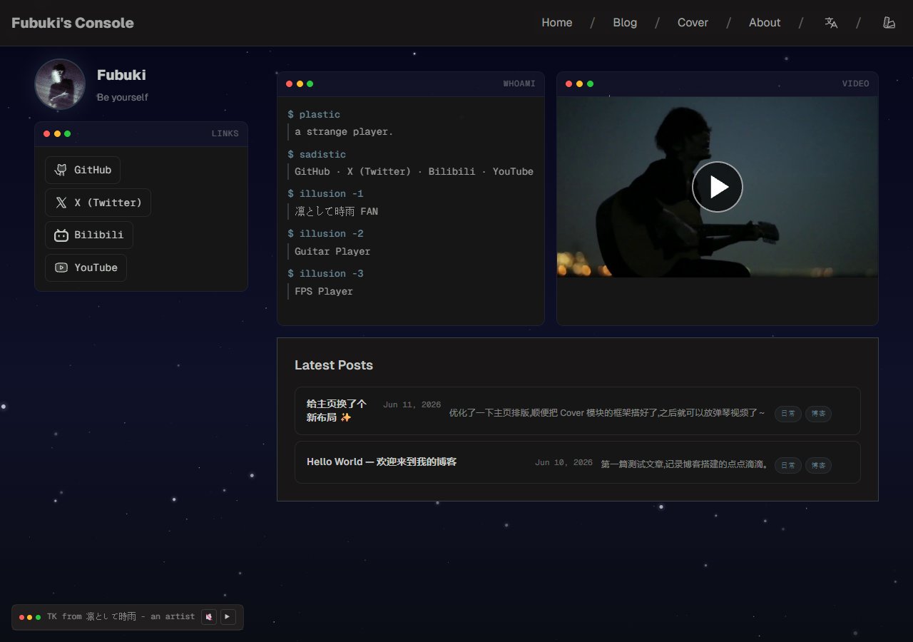

<div align="center">

  # ❄️ Fubuki's Station

  **吹雪降臨** — 一个融合 Spectre 美学与终端风格的 Astro 个人博客

  [](https://astro.build)
  [](https://tailwindcss.com)
  [](https://pages.cloudflare.com)
  [](./LICENSE)

  🌐 **[fubuki.asia](https://fubuki.asia)**

  <br>
  
</div>

---

## ✨ 特性

<table>
  <tr>
    <td>🎨 <b>60+ 主题</b></td>
    <td>Shiki 驱动的动态主题系统，一键切换明暗风格</td>
  </tr>
  <tr>
    <td>💻 <b>终端美学</b></td>
    <td>macOS 风格窗口组件，红黄绿圆点 + 命令行提示符</td>
  </tr>
  <tr>
    <td>🌐 <b>双语支持</b></td>
    <td>中文 / English，文件名后缀自动识别语言版本</td>
  </tr>
  <tr>
    <td>🌸 <b>樱花入场动画</b></td>
    <td>每次访问首页随机主题 + 花瓣飘落 + 黑客帝国风格解码效果</td>
  </tr>
  <tr>
    <td>🎵 <b>内置音乐播放器</b></td>
    <td>淡入播放 TK from 凛として時雨，支持音量调节</td>
  </tr>
  <tr>
    <td>📱 <b>响应式设计</b></td>
    <td>移动端适配，导航栏自动隐藏/显示</td>
  </tr>
  <tr>
    <td>💬 <b>Giscus 评论</b></td>
    <td>GitHub Discussions 驱动的评论系统</td>
  </tr>
  <tr>
    <td>⚡ <b>SPA 导航</b></td>
    <td>View Transitions API 实现无刷新页面切换</td>
  </tr>
</table>

## 🛠 技术栈

| 类别 | 技术 |
|------|------|
| 框架 | [Astro 5](https://astro.build) |
| 样式 | [Tailwind CSS v4](https://tailwindcss.com) |
| 图标 | [Astro Icon](https://github.com/natemoo-re/astro-icon) + Phosphor |
| 内容 | MDX + Markdown with code highlighting |
| 部署 | [Cloudflare Pages](https://pages.cloudflare.com) |
| 评论 | [Giscus](https://giscus.app) |

## 🚀 本地开发

```bash
# 安装依赖
yarn install

# 启动开发服务器
yarn dev

# 构建生产版本
yarn build

# 预览构建结果
yarn preview

# 生成主题颜色
yarn generate:themes
```

## 📝 写博客

在 `src/content/blog/` 下创建 `.md` 文件：

```markdown
---
title: "文章标题"
description: "文章摘要"
pubDate: 2026-06-11
tags: [日常, 技术]
heroImage: "../../assets/blog-placeholder-1.jpg"
---

正文内容...
```

多语言：`my-post.md`（默认） + `my-post.en.md`（英文）

## 📄 License

MIT © [RIMECHU](https://github.com/RIMECHU)

---

<div align="center">
  <sub>Made with ❤️ by Fubuki · <a href="https://fubuki.asia">fubuki.asia</a></sub>
</div>
